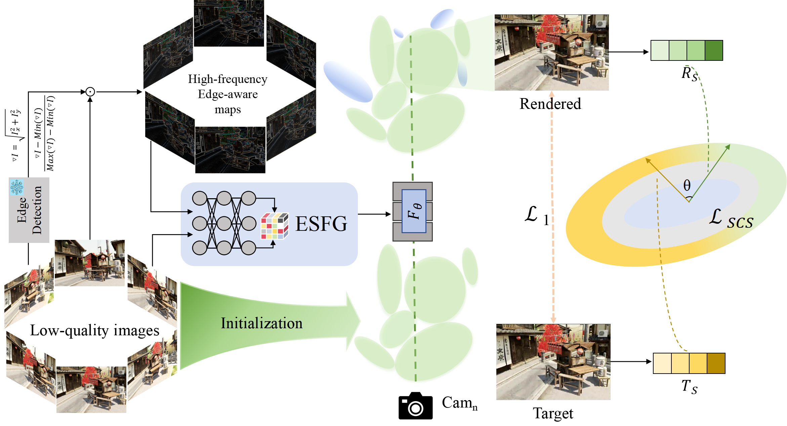

# 【ICLR 2025】HQGS: High-Quality Novel View Synthesis with Gaussian Splatting in Degraded Scene
### Xin Lin*, Shi Luo*, Xiaojun Shan, Xiaoyu Zhou, Chao Ren, Lu Qi, Ming-Hsuan Yang and Nuno Vasconcelos. 
# The paper is here [HQGS](https://openreview.net/pdf?id=25Zlvl7JxW).
This is the official code of HQGS.

## Abstract
3D Gaussian Splatting (3DGS) has shown promising results for Novel View Synthesis. However, while it is quite effective when based on high-quality images, its performance declines as image quality degrades, due to lack of resolution, motion blur, noise, compression artifacts, or other factors common in real-world data collection. While some solutions have been proposed for specific types of degradation, general techniques are still missing. To address the problem, we propose a robust HQGS that significantly enhances the 3DGS under various degradation scenarios. We first analyze that 3DGS lacks sufficient attention in some detailed
regions in low-quality scenes, leading to the absence of Gaussian primitives inthose areas and resulting in loss of detail in the rendered images. To address this issue, we focus on leveraging edge structural information to provide additional guidance for 3DGS, enhancing its robustness. First, we introduce an edge semantic fusion guidance module that combines rich texture information from high-frequency edge-aware maps with semantic information from images. The fused features serve as prior guidance to capture detailed distribution across different regions, bringing more attention to areas with detailed edge information and allowing for a higher concentration of Gaussian primitives to be assigned to such areas. Additionally, we present a structural cosine similarity loss to complement pixel-level constraints, further improving the quality of the rendered images. Extensive experiments demonstrate that our method offers better robustness and achieves the best results across various degraded scenes.

## Requirements
Our experiments is the same as 3DGS and SRGS.

## Dataset
Our approach utilzes the LLFF and DeblurNeRF datasets, divided into the seen data used for training and the unseen data for testing, and we construct a low-quality dataset by synthesizing a variety of degraded qualities for all of them, and get the restored images by utilzing the existing restoration network.

For the seen data, we use Sobel operator to get the edge map and concat, which is implemented in gradient.py. For the raw image, we implement concat via images_concat.py. This gives us two inputs to the ESFG.

The rest of the training and testing comes from the original 3DGS algorithm. 

## Citation

    @inproceedings{HQGS,
      title={High-Quality Novel View Synthesis with Gaussian Splatting in Degraded Scene}, 
      author={Xin Lin, Shi Luo, Xiaojun Shan, Xiaoyu Zhou, Chao Ren, Lu Qi, Ming-Hsuan Yang and Nuno Vasconcelos},
      booktitle={Proceedings of the International Conference on Learning Representation},
      year={2025}
    }

## Contact
If you have any questions, please contact linxin@stu.scu.edu.cn

